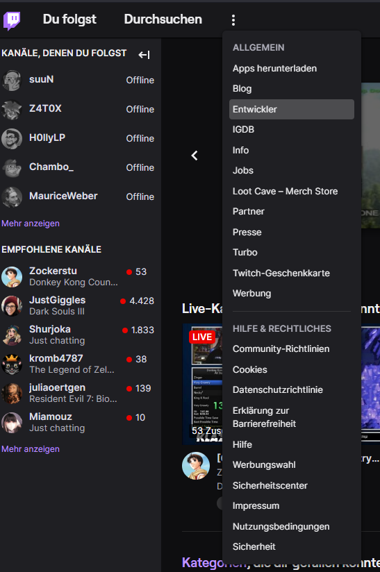
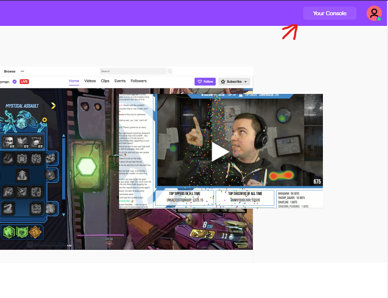
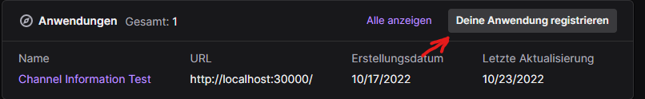
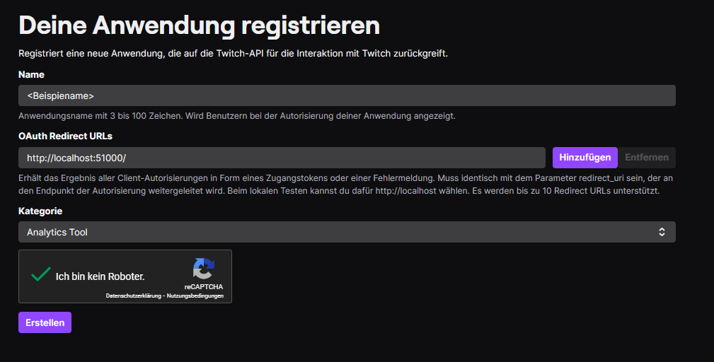
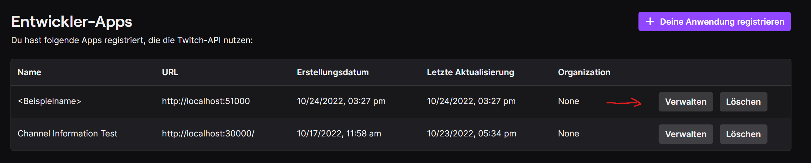
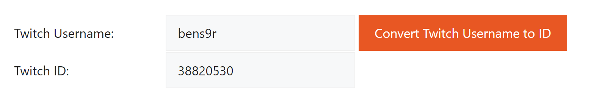

# Anleitung

1. Go to http://twitch.tv

2. Über das Dot-Menü den Unterpunkt Entwickler öffnen:  


3. Falls notwendig auch dort anmelden.

4. In der rechten oberen Ecke die "Your Console" öffnen:  


5. Im nächsten Dialog, auf der rechten Seite, im Kasten Anwendungen den Button "Deine Anwendung registieren" drücken.


6. Im folgenden Dialog nun die Anwendung inital registrieren.  
Zu diesem Zweck einen irgendeinen Namen eingeben. Es könnte sein, dass Twitch meckert, weil der Name schon existiert. Dann einen anderen wählen.  
Im Feld "OAuth Redirect URLs" eine lokale Addresse eingeben. Bspw.: http://localhost:51000/.  
(!) Der abschließende "/" ist hier wichtig, da die Applikation immer einen abschließenden Slash bei der Kommunikation mit Twitch einfügt.  
Diese URL bitte notieren, da wir diese zum konfigurieren der Applikation benötigen.  
Als Kategorie "Analytics Tool" wählen.  
Das reCaptcha noch bedienen und auf den Button erstellen drücken.  


7. Anschließen bei in der Zeile der gerade erstellten App den Button Verwalten drücken, da wir noch mehr Informationen ergänzen müssen.  


8. Im folgenden Dialog über den Button Neues Geheimnis ein neues "Client-Geheimnis" konfigurieren.  
Die Inhalte der beiden Felder "Client-ID" und "Client-Geheimnis" bitte notieren.  
Diese benötigen wir im anschluss für die Konfigurierung der Applikation.
Anschließend speichern

9. Für die Applikation benötigen wir noch die Broadcaster-ID.  
Das ist eine twitch interne Id, welche den jeweiligen Streamer kennzeichnet.  
Über die Website https://www.streamweasels.com/tools/convert-twitch-username-to-user-id/ können wir die Broadcaster-ID ermitteln.
Im Feld "Twitch Username" deinen Streamer-Namen eingeben und mit dem Convert-Button rechts daneben bestätigen.  
Die Twitch ID aka. Broadcaster-ID bitte notieren. Diese benötigen wir im anschluss für die Konfigurierung der Applikation.  


10. Vorausgesetzt die Applikation wurde schon auf deinem Rechner entpackt, die Datei appsettings.json öffnen.  
Darin nun die vorher notierten Text entsprechend innerhalb der "" eintragen.
    ```
    {
        "Settings": {
        "CsvOutputDirectory": ".",
        "TwitchAuthorizationUri": "https://id.twitch.tv/oauth2/authorize",
        "TwitchOAuthUri": "https://id.twitch.tv/oauth2/token",
        "TwitchHelixUri": "https://api.twitch.tv/helix/subscriptions",
        "ApplicationRedirectUri": "",
        "ClientId": "",
        "ClientSecret": "",  
        "BroadcasterId": ""
    }
    ```
Der Parameter "CsvOutputDirectory" kann frei mit einem Zielverzeichnes belegt werden, in das die zu erstellende Datei geschrieben werden soll.  

11. Beim erstmaligen Starten der Applikation wird sich, wenn alles korrekt konfiguriert ist, dein Browser öffnen und dich bitten dich bei Twitch einzuloggen.  
Dies ist erforderlich um der Applikation zu erlauben, auf die Schnittstelle zuzugreifen, welche Informationen über deine Subscriptions liefert.  
Auf mehr Daten wird nicht zugegriffen.

12. Wenn ich alles korrekt konfiguriert wurde, wird num im folgenden der tagesaktuelle Stand der Subscriptions deines Kanals in einer CSV-Datei unter dem von dir angegebenen Pfad abgelegt.

Viel Spaß damit.

# Troubleshooting
Es kann natürlich sein, dass es zu Fehlern kommt.  
Sollte es mal nicht funktionieren, im Verzeichnis in dem die Exe liegt, folgende Dateien löschen:
- accessRefreshToken
- accessToken
- permissionToken  

Dies führt dazu, dass alle beim erstmaligen Starten ermittelten Zugangsinformationen gelöscht sind.  
Beim erneuten Starten wirst du nun wieder gebeten, dich bei Twitch anzumelden, damit die erforderlichen Zugangsinformationen wieder ermittelt werden können.

Sollte es dann immernoch nicht funktionieren:
Die Applikation schreibt eine Protokoll-Datei in dem Verzeichnis in dem diese ausgeführt wird.
Gerne mir die Datei bei fehlern senden.


